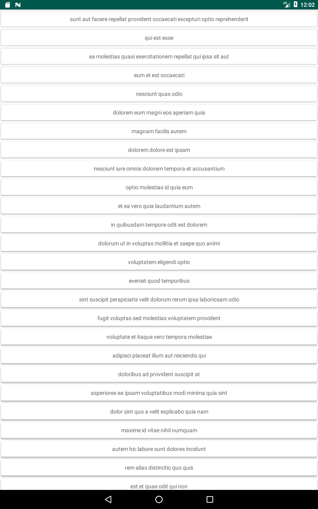

# Android + MVVM + Coroutines Flow + Koin + Testing :heart:
      

This is an example of an Android App who uses coroutines flow to retrieve a list of https://jsonplaceholder.typicode.com/posts but retrieve the data one per one and be added to the RecyclerView.

## Dependencies

- Material 1 [version: '1.1.0'](https://developer.android.com/guide/topics/ui/look-and-feel)
- AndroidX [version: '1.0.0'](https://mvnrepository.com/artifact/androidx)
- LifeCycleKtx 2 [version: '2.2.0'](https://developer.android.com/kotlin/ktx)
- Koin 2 [version: '2.2.0'](https://insert-koin.io)
- Coroutines 1 [version: '1.3.3'](https://kotlinlang.org/docs/reference/coroutines-overview.html)
- Coroutines Test 1 [version '1.3.2'](https://github.com/Kotlin/kotlinx.coroutines/tree/master/kotlinx-coroutines-test)
- Retrofit 2 [version: '2.6.0'](https://square.github.io/retrofit/)
- Gson [version:'2.7.1'](https://github.com/google/gson)
- OkHttp 4 [version: '4.2.2'](https://square.github.io/okhttp/)
- Mockk 1 [version: '1.9.3'](https://github.com/mockk/mockk)
- Arch Testing 1 [version: '1.1.1'](https://mvnrepository.com/artifact/android.arch.core/core-testing?repo=google)
- JUnit 4 [version: '4.12'](https://junit.org/junit4/)

# References

- Asynchronous development in Android: RxJava Vs. Kotlin Flow https://medium.com/makingtuenti/asynchronous-development-in-android-rxjava-vs-kotlin-flow-f7fdf2e2f81b

- LiveData with Coroutines and Flow (Android Dev Summit '19) https://www.youtube.com/watch?v=B8ppnjGPAGE

- Reactive scrabble benchmarks https://github.com/Kotlin/kotlinx.coroutines/blob/develop/benchmarks/src/jmh/kotlin/benchmarks/flow/scrabble/README.md

- Unit-testing LiveData and other common observability problems https://medium.com/androiddevelopers/unit-testing-livedata-and-other-common-observability-problems-bb477262eb04

- MVVM Testing w/Coroutines https://github.com/emedinaa/kotlin-mvvm/tree/coroutines?fbclid=IwAR1XZW4yr-LuwlOYnVIz_glvsNunsdvloMHq3-Y8iGTNL2F4fJxhLNGizSo

## Contributors ✨

Thanks goes to these wonderful people ([emoji key](https://allcontributors.org/docs/en/emoji-key)):

<!-- ALL-CONTRIBUTORS-LIST:START - Do not remove or modify this section -->
<!-- prettier-ignore-start -->
<!-- markdownlint-disable -->
<table>
  <tr>
    <td align="center"><a href="https://github.com/carlosgub"> <b>Carlos Ugaz</b></a> </td>
    <td align="center"><a href="https://github.com/jozedi"> <b>Jose Diaz</b></td>
  </tr>
</table>

<!-- markdownlint-enable -->
<!-- prettier-ignore-end -->
<!-- ALL-CONTRIBUTORS-LIST:END -->
